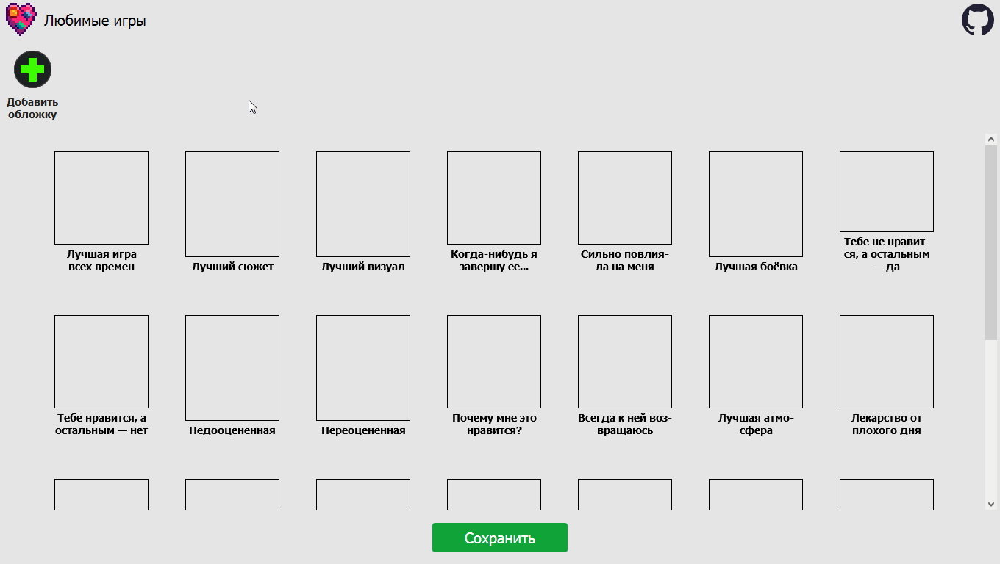

# table-of-favorite-games

Веб-приложение, позволяющее распределить любимые игры по категориям и вывести итог в таблицу, чтобы поделиться с окружающими.



Создано специально для таких, как я, которым лень фотошопить (но не лень тратить кучу времени на разработку веб-приложения ).

## Вдохновение

Вдохновила таблица-шаблон (см. ниже) от некого [powar3nok](https://discord.com/users/370460453689753600) на [Корабль котиков](https://discord.com/invite/cGTbUSSpbV), что и запустило эту вакханалию.

<figure>
  
  <figcaption align="center"><em><a href="https://discord.com/channels/876474448126050394/876706882423762994/1368666713482199170">Ссылка на сообщение</a>, с которого всё началось.</em></figcaption>
</figure>

## Documentation

Placed in the `docs/` folder, started with the [intro](intro.md).

## Build

```npm
npm run build
```

## Development

```
npm run dev
```
